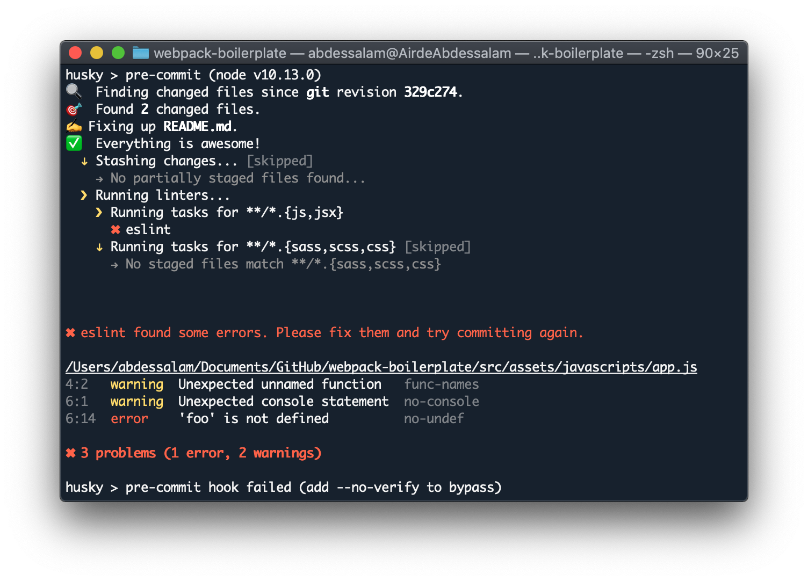
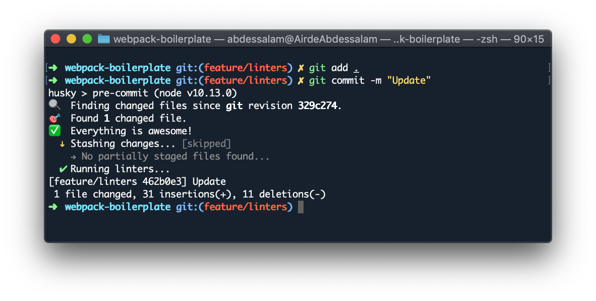

# Webpack Boilerplate

> This starter project aims to be more productive when starting a webpack project.

## Requirements

This starter project should be working as expected with the following minimal version of:

| Dependency |  Version  |
| ---------- | :-------: |
| Node       | >= v8.0.0 |
| NPM        | >= v5.0.0 |

## 🚀 Quick start

1.  **Clone the git repository**

```bash
# cloning git repository into `my-webpack-starter` folder
git clone https://github.com/Abdessalam98/webpack-boilerplate my-webpack-starter

# install project dependencies
cd my-webpack-starter && npm install
```

2.  **Start Developing**

**Dev Version**

```bash
npm run dev
```

**Prod Server**

```bash
npm run prod
```

3.  **Open browser and start editing files!**

## 🧐 What's inside?

```
.
├── node_modules        # This is the directory of the modules (npm packages) for your project
├── src                 # This is the directory of entry point files related to the front-end of your site
|   ├── index.js        # This is the entry point file for Webpack
|   └── assets
|        ├── fonts
|        ├── images
|        ├── javascripts
|        └── stylesheets
├── .gitignore          # This file tells git which files it should not track
├── .prettierrc.json    # This is the configuration file for Prettier
├── .eslintrc.json      # This is the configuration file for ESLint
├── .stylelintrc.json   # This is the configuration file for stylelint
├── index.html          # This is the file where Webpack serve content
├── package.json        # This file tells npm which packages to install for your project
├── README.md
├── LICENSE
├── webpack.common.js   # Webpack configuration files
├── webpack.dev.js
└── webpack.prod.js
```

## ✨ Features

-   Babel
-   Linting with ESLint and Stylelint
-   Code formatting with Prettier
-   Precommit with husky and lint-staged

## 💩 When trying to commit bad code

It runs linters before committing and prevents errors to go in your repository.

**Example with errors**



**Example after fixing errors**



## Author

[Abdessalam BENHARIRA](https://abdessalam-benharira.me)
